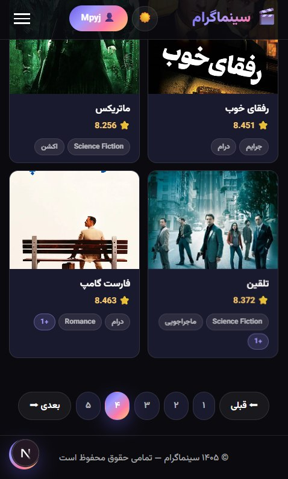
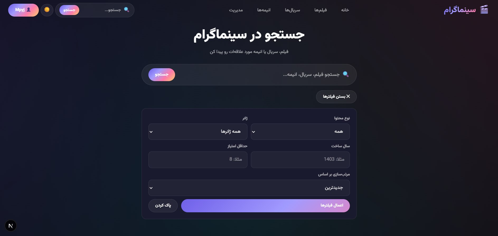
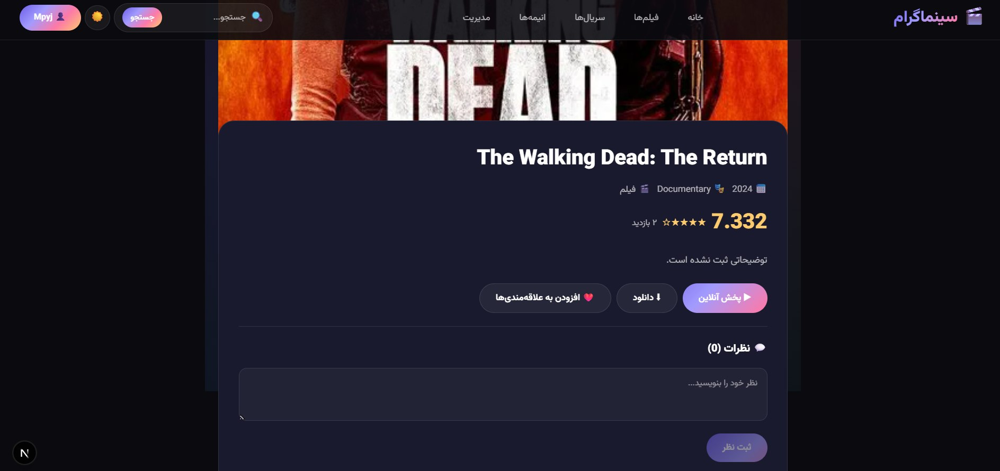
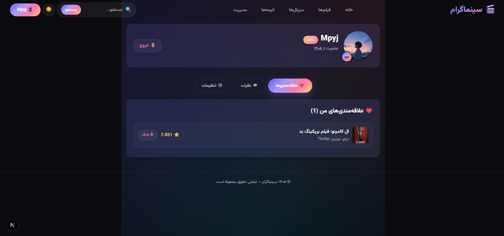
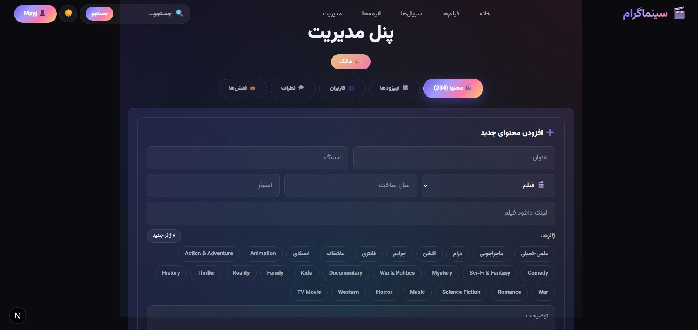

# 🎬 Cinemagram

> A modern full-stack platform for movies, TV series, and anime.

[🇮🇷 مشاهده README فارسی](./README.fa.md)

<div align="center">


# Cinemagram

### Movies. Series. Anime. One place.

</div>

---

## 📸 Screenshots

### 🖥️ Desktop


### 📱 Mobile



### 🔍 Search



### 🎬 Content Details



### 👤 Profile



### 🛡️ Admin Panel



---

## ✨ Features

### 👥 Users

- Registration
- Login / Logout
- JWT authentication
- Profile avatar upload
- Change username, email and password
- Membership date display
- Persian calendar date support
- User role display
- Personal profile
- Personal watchlist

### 🛡️ Roles

Cinemagram includes three roles:

| Role | Permissions |
|------|-------------|
| 👑 Owner | Full access + promote / demote admins |
| 🛡️ Admin | Manage content, users and comments |
| 👤 User | Use the platform |

Admins can manage users with actions such as ban and mute.

---

## 🎬 Content Management

Cinemagram supports:

- 🎞️ Movies
- 📺 TV Series
- 🍿 Anime

Admins can:

- Add content
- Edit content
- Delete content
- Upload posters
- Assign multiple genres
- Create new genres
- Set release year
- Set rating from 0 to 10
- Add movie download links
- Create seasons
- Add episodes
- Add episode links

---

## 🔍 Search

### Search

- Search by title

### Filters

- Content type
- Genre
- Release year
- Minimum rating

### Sorting

- Newest
- Rating
- Views
- Release year

---

## ❤️ Watchlist

Users can:

- Add content to their watchlist
- Remove content from their watchlist
- View saved content from their profile

---

## 💬 Comments

Users can comment on movies, series and anime.

Each comment includes:

- Username
- Profile avatar
- Comment text

Admins can:

- Approve comments
- Hide comments
- Delete comments

---

## 📥 Download System

### Movies

Movies can provide direct download links.

### Series & Anime

Episodes are organized by season:

Season 1
├── Episode 1
├── Episode 2
└── Episode 3

Season 2
├── Episode 1
├── Episode 2
└── Episode 3

---

## 📥 Automated Import

Cinemagram supports automated content importing.

### 🎥 TMDB

Import movies and TV series with available:

- Title
- Poster
- Genres
- Rating
- Metadata

### 🍿 Jikan / MyAnimeList

Anime information can be imported through the Jikan API.

### 📄 Local Files

Supported formats:

- JSON
- CSV
- Excel
- Text files containing links

---

## 📱 Responsive UI

Designed for:

- 📱 Mobile
- 📲 Tablet
- 💻 Desktop

Includes:

- Responsive layout
- Mobile hamburger menu
- Dark / Light mode
- Pagination
- Framer Motion animations
- Hover effects
- Active states
- Glassmorphism
- Animated gradient backgrounds

---

## 🎨 Design

Cinemagram uses a modern cinematic visual identity.

- Purple / Pink / Turquoise color palette
- Glassmorphism
- Animated gradients
- Framer Motion animations
- Dark / Light themes
- Vazirmatn font
- Modern hover and active effects

---

## 🛠️ Tech Stack

### Backend

- Python
- FastAPI
- PostgreSQL
- SQLAlchemy
- Pydantic
- JWT

### Frontend

- Next.js 14
- TypeScript
- Tailwind CSS
- Framer Motion
- Axios

### External APIs

- TMDB — Movies & TV Series
- Jikan / MyAnimeList — Anime

---

## 📁 Project Structure

```text
Cinemagram/
├── README.md
├── README.fa.md
├── assets/
│   └── logo.jpg
├── screenshots/
│   ├── home.jpg
│   ├── phone.jpg
│   ├── search.jpg
│   ├── content.jpg
│   ├── profile.jpg
│   └── admin.jpg
│
├── backend/
│   ├── app/
│   │   ├── __init__.py
│   │   ├── main.py
│   │   │
│   │   ├── core/
│   │   │   ├── __init__.py
│   │   │   ├── config.py
│   │   │   ├── database.py
│   │   │   └── security.py
│   │   │
│   │   ├── models/
│   │   │   ├── __init__.py
│   │   │   ├── user.py
│   │   │   ├── content.py
│   │   │   ├── genre.py
│   │   │   ├── episode.py
│   │   │   ├── comment.py
│   │   │   ├── rating.py
│   │   │   └── watchlist.py
│   │   │
│   │   ├── schemas/
│   │   │   ├── __init__.py
│   │   │   ├── user.py
│   │   │   ├── content.py
│   │   │   ├── genre.py
│   │   │   ├── episode.py
│   │   │   ├── comment.py
│   │   │   └── auth.py
│   │   │
│   │   ├── routers/
│   │   │   ├── __init__.py
│   │   │   ├── auth.py
│   │   │   ├── users.py
│   │   │   ├── content.py
│   │   │   ├── episodes.py
│   │   │   ├── genres.py
│   │   │   ├── comments.py
│   │   │   ├── watchlist.py
│   │   │   └── admin.py
│   │   │
│   │   ├── services/
│   │   │   ├── auth_service.py
│   │   │   ├── content_service.py
│   │   │   └── user_service.py
│   │   │
│   │   └── utils/
│   │       ├── file_upload.py
│   │       └── validators.py
│   │
│   ├── uploads/
│   │   ├── posters/
│   │   └── avatars/
│   │
│   ├── import_from_tmdb.py
│   ├── import_anime.py
│   ├── seed_data.py
│   └── requirements.txt
│
└── frontend/
    ├── .env.local
    ├── .gitignore
    ├── next.config.ts
    ├── package.json
    ├── tsconfig.json
    │
    ├── app/
    │   ├── layout.tsx
    │   ├── page.tsx
    │   ├── globals.css
    │   │
    │   ├── login/
    │   │   └── page.tsx
    │   │
    │   ├── register/
    │   │   └── page.tsx
    │   │
    │   ├── search/
    │   │   └── page.tsx
    │   │
    │   ├── profile/
    │   │   └── page.tsx
    │   │
    │   ├── admin/
    │   │   └── page.tsx
    │   │
    │   └── content/
    │       └── [slug]/
    │           └── page.tsx
    │
    ├── components/
    │   ├── layout/
    │   │   ├── Navbar.tsx
    │   │   └── Footer.tsx
    │   │
    │   ├── home/
    │   │   ├── Hero.tsx
    │   │   ├── CategoryTabs.tsx
    │   │   └── ContentGrid.tsx
    │   │
    │   ├── content/
    │   │   └── MovieCard.tsx
    │   │
    │   └── ui/
    │       └── BackToTop.tsx
    │
    ├── context/
    │   ├── ThemeContext.tsx
    │   └── AuthContext.tsx
    │
    ├── hooks/
    │   ├── useAuth.ts
    │   └── useContent.ts
    │
    ├── lib/
    │   ├── api.ts
    │   └── types.ts
    │
    └── public/
        └── fonts/
            ├── Vazirmatn-Regular.woff2
            ├── Vazirmatn-Bold.woff2
            └── Vazirmatn-Black.woff2

---

## 🚀 Getting Started

### Clone the Repository

git clone https://github.com/Mpyj/Cinemagram.git
cd Cinemagram

### Backend

cd backend

python -m venv venv

Windows:

venv\Scripts\activate

Install dependencies:

pip install -r requirements.txt

Run the backend:

uvicorn app.main:app --reload

---

## 🗄️ Database

Make sure PostgreSQL is running.

psql -U postgres -h localhost

Create the database:

CREATE DATABASE cinemagram;

Seed initial data:

python seed_data.py

---

## 🌐 Frontend

cd frontend

npm install

npm run dev

---

## 📥 Import Content

### Movies

python import_from_tmdb.py movies_list.txt --list

### TV Series

python import_from_tmdb.py series_list.txt --list

### Anime

python import_anime.py anime_list.txt --list

---

## 🔐 Environment Variables

Create a .env.local file inside the frontend directory.

Example:

NEXT_PUBLIC_API_URL=

Configure the required environment variables according to your local setup.

> Important: Never commit API keys, passwords, database credentials, JWT secrets or .env.local to Git.

---

## 🧩 Architecture

                    ┌───────────────────┐
                    │      Next.js      │
                    │     Frontend      │
                    └─────────┬─────────┘
                              │
                              │ REST API
                              ▼
                    ┌───────────────────┐
                    │      FastAPI      │
                    │      Backend      │
                    └─────────┬─────────┘
                              │
                              ▼
                    ┌───────────────────┐
                    │    PostgreSQL     │
                    │     Database      │
                    └───────────────────┘

                         External APIs
                              │
                 ┌────────────┴────────────┐
                 ▼                         ▼
               TMDB                      Jikan

---

## 📌 Pagination

Content lists use 20 items per page.

---

## 🔮 Future Plans

- Personalized recommendations
- Watch history
- Continue Watching
- Multiple download qualities
- Advanced admin analytics
- More import sources
- Notification system
- Advanced caching
- SEO improvements
- Deployment automation

---

## ⚖️ Usage & Attribution

Cinemagram is available for learning, personal use, inspection and development.

Using parts of the source code, design or project structure is allowed with proper attribution.

### Rules

- Educational and personal use is allowed.
- Source code may be reused with attribution.
- Modified versions must credit Mpyj as the original creator.
- Removing the original creator's name or source is not allowed.
- Republishing the complete project without attribution is not allowed.

### Attribution

Cinemagram
Created by Mpyj
Source: https://github.com/Mpyj/Cinemagram
Telegram: https://t.me/MpyjTelegram

---

## 👨‍💻 Created by Mpyj

Mpyj

Programmer • Builder • Tech Enthusiast

GitHub: https://github.com/Mpyj
Telegram: https://t.me/MpyjTelegram

---

## 📄 License

This project is distributed under the usage and attribution terms described in this README.

For commercial use or full-project redistribution, please contact the original creator.

---

# 🎬 Cinemagram

### Movies. Series. Anime. One place.

Built with ❤️ and code by Mpyj.